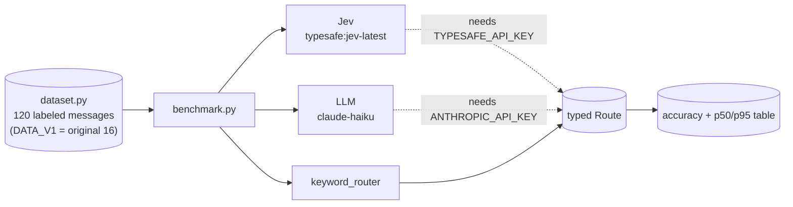

# Jev Agent Router

### *Keyword vs LLM vs Jev: accuracy and latency, measured*

<div align="center">

[](https://www.python.org/)
[](https://ai.pydantic.dev/)
[](https://typesafe.ai/blog/introducing-system-one-models-and-jev)
[](tests/)

</div>

Routes customer messages to the right team (`billing`, `bug`, `account`,
`sales`) three ways and compares them on the same labeled set: a keyword
baseline, an LLM (Claude Haiku), and TypeSafe's Jev. All three return the same
typed `Route`, so the comparison is about accuracy and latency, not output format.

**Why this exists:** Jev is a new kind of model. It does not generate text; it
returns a typed decision with confidence in one pass. Routing is the clearest
place to test the claim that this is faster and cheaper than an LLM without
losing accuracy. I wanted that comparison measured before building anything on top of it.

> **Why this repo exists:** to learn how a decision-only model behaves next to
> an LLM and a plain baseline, and to build the harness first so that when
> API access is available the numbers are reproducible, not anecdotes.

> **Related work in this portfolio:** this is the benchmark behind
> [edge-sentinel](https://github.com/PlainJane20/edge-sentinel), whose decision
> cascade trusts Jev when confident and escalates otherwise. The routing shape
> comes from [switchboard](https://github.com/PlainJane20/switchboard); a Jev
> backend there is a planned next step.

## At a glance

| | |
|---|---|
| **Problem** | Does a decision-only model route as accurately as an LLM, and how much faster is it? |
| **Approach** | Three routers behind one typed interface, one labeled dataset, p50 and p95 latency |
| **Proof so far** | Jev 100% on the original 16 messages (DATA_V1, 3 runs); keyword baseline 81% on those 16 and 42% on the harder 120-message set; Jev and the LLM have **not** been run on the 120 set |
| **Output** | An accuracy and latency table per router |

## Competencies demonstrated

| Competency | Observable evidence |
|---|---|
| Evaluation design | One dataset and one typed output across all routers; limits written down in [METHODOLOGY](docs/METHODOLOGY.md) |
| Measurement discipline | Results stay "not run" until they are run; dataset size is stated next to every number |
| Technical judgment | A deterministic baseline first, so model results have something honest to beat |

## Results

### Jev on DATA_V1 (16 messages, 3 runs on 2026-10-05)

Run on 2026-10-05 from an Apple M4 Pro, three consecutive runs per router. Jev was
called through `typesafe:jev-latest` over the public internet, one request at a time,
so its latency includes the network round trip. This is the original 16-message set,
now kept as `DATA_V1`.

| Router | Accuracy on DATA_V1, 16 messages, 3 runs on 2026-10-05 | p50 | p95 | Status |
|---|---|---|---|---|
| keywords | 81% (13 of 16) | under 0.1 ms | under 0.1 ms | measured |
| jev | **100% (16 of 16), all 3 runs** | 109 to 113 ms | 172 to 254 ms | measured |
| llm-haiku | n/a | n/a | n/a | not run (needs `ANTHROPIC_API_KEY`) |

**The 100% figure applies only to DATA_V1.** Jev and the LLM have **not** been run on
the 120-message set. No model result exists for the 104 newer messages.

### Keyword baseline on the 120-message set (DATA)

Run offline with `python -m router.benchmark` (no API keys, one run; the baseline is
deterministic). 120 messages, 30 per team, 9 flagged ambiguous and reported separately.

| Slice | Accuracy |
|---|---|
| Headline (excludes 9 ambiguous) | **42% (47 of 111)** |
| Full set (includes ambiguous) | 40% (48 of 120) |
| Ambiguous only | 11% (1 of 9) |

By kind (headline set):

| Kind | Accuracy |
|---|---|
| easy (contains the team's own keyword) | 100% (28 of 28) |
| no-keyword | 29% (9 of 31) |
| misleading-keyword | 0% (0 of 14) |
| multi-intent | 25% (4 of 16) |
| terse | 27% (3 of 11) |
| noisy | 27% (3 of 11) |

Confusion (rows are the true team, columns the prediction):

| true \ predicted | billing | bug | account | sales |
|---|---|---|---|---|
| billing | 8 | 19 | 1 | 2 |
| bug | 1 | 26 | 1 | 2 |
| account | 1 | 21 | 6 | 2 |
| sales | 3 | 18 | 1 | 8 |

Most misses are messages with no keyword falling through to the default `bug` route
(bug recall looks high only because `bug` is the default).

**How to read this:** the new messages were written to be hard for keyword matching,
so 0% on misleading-keyword is by construction, and the 42% says how adversarial the
set is more than how good any real router is. The same person wrote both the baseline
and the data (see [METHODOLOGY](docs/METHODOLOGY.md)). There is still no Jev-vs-LLM
comparison and none should be quoted until both are run on the 120 set, several times.

Jev also returns calibrated probabilities. For "I was charged twice for my subscription
this month" it returned `billing` with probability 1.0 and `confidence: {"response": 1.0}`.

## Real findings from building this

1. **The baseline's misses all fell through to the default route.** Three of
   the 16 messages matched no keyword and were sent to `bug`: "Need to change
   the email address on my profile" (account), "Why does my bill say $99 when the
   page says $79?" (billing) and "How do I add a second admin to our workspace?"
   (account). A silent default hides failures; a router that can say "no match" is
   better, which is the idea behind confidence-based escalation.
2. **Output format is controlled so accuracy is comparable.** Every router
   returns the same `Route` enum, so a wrong answer is a wrong team and not a parsing failure.

## Architecture



## Setup

```bash
python3 -m venv .venv && source .venv/bin/activate
pip install -r requirements.txt
python -m pytest
```

## Usage

```bash
python -m router.benchmark                  # keyword baseline only, 120 messages
python -m router.benchmark --v1             # original 16 messages only
python -m router.benchmark --repeat 3       # three runs per router

pip install "pydantic-ai-slim[typesafe,anthropic]"
export TYPESAFE_API_KEY=...                 # enables the Jev router
export ANTHROPIC_API_KEY=...                # enables the LLM router
python -m router.benchmark
```

## What I'd add next

- [x] Grow the dataset to 100 or more (done: 120, with ids, kinds and an ambiguous list; Jev and the LLM still need to be run on it)
- [ ] Run Jev on the 120-message set, several times
- [x] Run Jev several times (done: 3 runs)
- [ ] Run the LLM router several times and record model versions
- [ ] Add a cost column from published per-token prices
- [x] Verify how Jev returns confidence (a dict like `{"response": 1.0}` plus per-class probabilities)
- [ ] Test escalating low-confidence messages to the LLM
- [ ] Contribute a Jev backend to `switchboard`

## Repository map

```
jev-agent-router/
├── router/       routers, dataset, benchmark
├── tests/        baseline tests
└── docs/         methodology and limits
```

## Contact

<div align="center">

### **Navi Sohi**
*Technical Program Manager & Automation Engineer*

<br>

[](https://www.linkedin.com/in/navisohi/)
[](https://github.com/PlainJane20)
[](https://mail.google.com/mail/?view=cm&fs=1&to=nks.ai.dev@gmail.com)

<br>

</div>

## License

MIT
