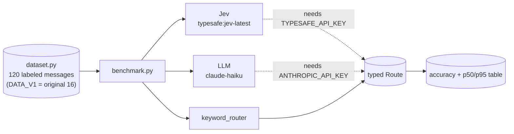

# Jev Agent Router

### *Keyword vs LLM vs Jev: accuracy and latency, measured*

<div align="center">

[](https://www.python.org/)
[](https://ai.pydantic.dev/)
[](https://typesafe.ai/blog/introducing-system-one-models-and-jev)
[](tests/)

</div>

Routes customer messages to the right team (`billing`, `bug`, `account`,
`sales`) three ways and compares them on the same labeled set: a keyword
baseline, an LLM (Claude Haiku), and TypeSafe's Jev. All three return the same
typed `Route`, so the comparison is about accuracy and latency, not output format.

**Why this exists:** Jev is a new kind of model. It does not generate text; it
returns a typed decision with confidence in one pass. Routing is the clearest
place to test the claim that this is faster and cheaper than an LLM without
losing accuracy. I wanted that comparison measured before building anything on top of it.

> **Why this repo exists:** to learn how a decision-only model behaves next to
> an LLM and a plain baseline, and to build the harness first so that when
> API access is available the numbers are reproducible, not anecdotes.

> **Related work in this portfolio:** this is the benchmark behind
> [edge-sentinel](https://github.com/PlainJane20/edge-sentinel), whose decision
> cascade trusts Jev when confident and escalates otherwise. The routing shape
> comes from [switchboard](https://github.com/PlainJane20/switchboard); a Jev
> backend there is a planned next step.

## At a glance

| | |
|---|---|
| **Problem** | Does a decision-only model route as accurately as an LLM, and how much faster is it? |
| **Approach** | Three routers behind one typed interface, one labeled dataset, p50 and p95 latency |
| **Proof so far** | On 111 hard messages (3 runs): keywords 42%, Jev 98% at 116 ms median, Claude Haiku 99% at 607 ms median. Accuracy of the two models is within noise; Jev is about 5x faster. Cost not measured |
| **Output** | An accuracy and latency table per router |

## Competencies demonstrated

| Competency | Observable evidence |
|---|---|
| Evaluation design | One dataset and one typed output across all routers; limits written down in [METHODOLOGY](docs/METHODOLOGY.md) |
| Measurement discipline | Results stay "not run" until they are run; dataset size is stated next to every number |
| Technical judgment | A deterministic baseline first, so model results have something honest to beat |

## Results

### Jev on DATA_V1 (16 messages, 3 runs on 2026-10-05)

Run on 2026-10-05 from an Apple M4 Pro, three consecutive runs per router. Jev was
called through `typesafe:jev-latest` over the public internet, one request at a time,
so its latency includes the network round trip. This is the original 16-message set,
now kept as `DATA_V1`.

| Router | Accuracy on DATA_V1, 16 messages, 3 runs on 2026-10-05 | p50 | p95 | Status |
|---|---|---|---|---|
| keywords | 81% (13 of 16) | under 0.1 ms | under 0.1 ms | measured |
| jev | **100% (16 of 16), all 3 runs** | 109 to 113 ms | 172 to 254 ms | measured |
| llm-haiku | n/a | n/a | n/a | not run on this set; see the 120-message results below |

**The 100% figure applies only to DATA_V1**, which is mostly easy messages. The harder
120-message set is below.

### All three routers on the 120-message set (DATA)

Run on 2026-10-05 from an Apple M4 Pro with `python -m router.benchmark --repeat 3`.
Jev: `typesafe:jev-latest`. LLM: `claude-haiku-4-5-20251001`. Both through Pydantic AI
with the same one-line instruction and the same typed `Route` output. Requests were
sequential over the public internet, so latency includes the network. 120 messages,
30 per team; 9 are flagged ambiguous and reported separately.

| Router | Headline accuracy (111 messages) | Per run | p50 | p95 |
|---|---|---|---|---|
| keywords | 42% (141 of 333) | 47, 47, 47 of 111 | under 0.1 ms | under 0.1 ms |
| **jev** | **98% (327 of 333)** | 109, 109, 109 of 111 | **116 ms** | **170 ms** |
| **llm-haiku** | **99% (329 of 333)** | 110, 110, 109 of 111 | **607 ms** | **804 ms** |

| Slice | keywords | jev | llm-haiku |
|---|---|---|---|
| easy | 100% | 100% | 100% |
| no-keyword | 29% | 97% | 100% |
| misleading-keyword | 0% | 93% | 95% |
| multi-intent | 25% | 100% | 100% |
| terse | 27% | 100% | 94% |
| noisy | 27% | 100% | 100% |
| ambiguous only (27 predictions) | 11% | 44% | 59% |
| full set incl. ambiguous | 40% | 94% | 96% |

**What this shows:**
- Both models are far ahead of the keyword baseline, including on messages written to defeat it.
- Jev and Haiku are indistinguishable on accuracy here. The gap is two messages out of 111,
  and the three "runs" are repeats of the same 111 messages, not 333 independent samples.
- Jev's median latency is about 5 times lower (116 ms vs 607 ms), and its p95 is about 5 times lower.
- On ambiguous messages Haiku agrees with my labels more often (59% vs 44%), but those labels
  are arguable, so this says little.

**What it does not show:**
- **Cost.** Not measured. I did not compute per-call cost for either model.
- **Real-world accuracy.** I wrote the data (and the baseline), and the kind mix is not
  real ticket traffic. Labels are one person's judgment with no second annotator.
- **Concurrency, tail latency, or other days.** One machine, one afternoon, sequential calls.
- **Whether Haiku's latency is typical.** A different prompt, region or batching would change it.

Jev's errors on the headline set were two messages labeled `sales` that it routed to
`account`: "We'd like to extend our pilot to two more departments. Who should we talk to?"
and "We want to buy, but the evaluation account we created is locked until we talk to
someone. Can a rep call us?" The second arguably is an account issue.

Confusion matrices (rows are the true team, columns the prediction, all runs, ambiguous included):

| jev: true \ predicted | billing | bug | account | sales |
|---|---|---|---|---|
| billing | 87 | 3 | 0 | 0 |
| bug | 0 | 90 | 0 | 0 |
| account | 0 | 3 | 87 | 0 |
| sales | 9 | 0 | 6 | 75 |

| llm-haiku: true \ predicted | billing | bug | account | sales |
|---|---|---|---|---|
| billing | 90 | 0 | 0 | 0 |
| bug | 2 | 88 | 0 | 0 |
| account | 3 | 0 | 87 | 0 |
| sales | 8 | 0 | 2 | 80 |

Most keyword-baseline misses are messages with no keyword falling through to the default
`bug` route, so its bug recall looks high only because `bug` is the default.

Jev also returns calibrated probabilities. For "I was charged twice for my subscription
this month" it returned `billing` with probability 1.0 and `confidence: {"response": 1.0}`.
Using that confidence to escalate unsure messages to the LLM has not been tested here.

## Real findings from building this

1. **The baseline's misses all fell through to the default route.** Three of
   the 16 messages matched no keyword and were sent to `bug`: "Need to change
   the email address on my profile" (account), "Why does my bill say $99 when the
   page says $79?" (billing) and "How do I add a second admin to our workspace?"
   (account). A silent default hides failures; a router that can say "no match" is
   better, which is the idea behind confidence-based escalation.
2. **The original 16 messages overstated Jev, and the harder set is what separates the routers.**
   Jev scored 100% on the 16 easy-ish messages. On the 120-message set it scores 98%,
   and the keyword baseline falls from 81% to 42%. The easy set could not tell a
   good router from a mediocre one; the hard set does.
3. **Jev matches a small LLM on accuracy here at about a fifth of the latency.**
   98% vs 99% is two messages out of 111, which is within noise on this dataset.
   The latency gap (116 ms vs 607 ms median) is large and consistent across runs.
   Whether that holds on real traffic, and what it costs, is not known yet.
4. **Output format is controlled so accuracy is comparable.** Every router
   returns the same `Route` enum, so a wrong answer is a wrong team and not a parsing failure.

## Architecture



## Setup

```bash
python3 -m venv .venv && source .venv/bin/activate
pip install -r requirements.txt
python -m pytest
```

## Usage

```bash
python -m router.benchmark                  # keyword baseline only, 120 messages
python -m router.benchmark --v1             # original 16 messages only
python -m router.benchmark --repeat 3       # three runs per router

pip install "pydantic-ai-slim[typesafe,anthropic]"
export TYPESAFE_API_KEY=...                 # enables the Jev router
export ANTHROPIC_API_KEY=...                # enables the LLM router
python -m router.benchmark
```

## What I'd add next

- [x] Grow the dataset to 100 or more (done: 120, with ids, kinds and an ambiguous list)
- [x] Run Jev on the 120-message set, several times (done: 3 runs)
- [x] Run the LLM router several times (done: 3 runs, `claude-haiku-4-5-20251001`)
- [ ] Add a cost column from published per-token prices
- [ ] Get a second annotator for the labels and the ambiguous list
- [ ] Add messages written by someone other than the baseline's author, or real (anonymized) tickets
- [ ] Measure concurrent and repeated-day latency
- [x] Verify how Jev returns confidence (a dict like `{"response": 1.0}` plus per-class probabilities)
- [ ] Test escalating low-confidence messages to the LLM
- [ ] Contribute a Jev backend to `switchboard`

## Repository map

```
jev-agent-router/
├── router/       routers, dataset, benchmark
├── tests/        baseline tests
└── docs/         methodology and limits
```

## Contact

<div align="center">

### **Navi Sohi**
*Technical Program Manager & Automation Engineer*

<br>

[](https://www.linkedin.com/in/navisohi/)
[](https://github.com/PlainJane20)
[](https://mail.google.com/mail/?view=cm&fs=1&to=nks.ai.dev@gmail.com)

<br>

</div>

## License

MIT
