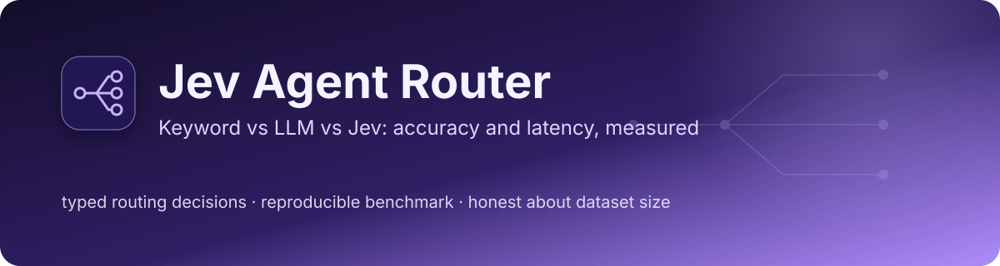
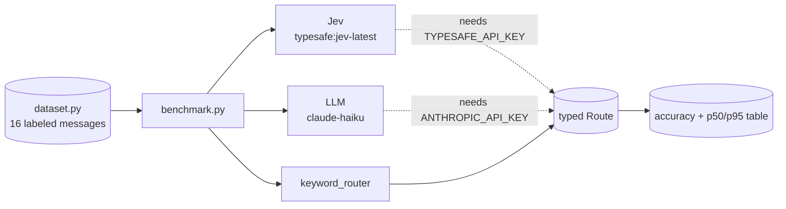

# Jev Agent Router

### *Keyword vs LLM vs Jev: accuracy and latency, measured*

<div align="center">

[](https://www.python.org/)
[](https://ai.pydantic.dev/)
[](https://typesafe.ai/blog/introducing-system-one-models-and-jev)
[](tests/)

</div>

Routes customer messages to the right team (`billing`, `bug`, `account`,
`sales`) three ways and compares them on the same labeled set: a keyword
baseline, an LLM (Claude Haiku), and TypeSafe's Jev. All three return the same
typed `Route`, so the comparison is about accuracy and latency, not output format.

**Why this exists:** Jev is a new kind of model. It does not generate text; it
returns a typed decision with confidence in one pass. Routing is the clearest
place to test the claim that this is faster and cheaper than an LLM without
losing accuracy. I wanted that comparison measured before building anything on top of it.

> **Why this repo exists:** to learn how a decision-only model behaves next to
> an LLM and a plain baseline, and to build the harness first so that when
> API access is available the numbers are reproducible, not anecdotes.

> **Related work in this portfolio:** this is the benchmark behind
> [edge-sentinel](https://github.com/PlainJane20/edge-sentinel), whose decision
> cascade trusts Jev when confident and escalates otherwise. The routing shape
> comes from [switchboard](https://github.com/PlainJane20/switchboard); a Jev
> backend there is a planned next step.

## At a glance

| | |
|---|---|
| **Problem** | Does a decision-only model route as accurately as an LLM, and how much faster is it? |
| **Approach** | Three routers behind one typed interface, one labeled dataset, p50 and p95 latency |
| **Proof so far** | The keyword baseline runs and is tested; model routers are wired but **not yet run** |
| **Output** | An accuracy and latency table per router |

## Competencies demonstrated

| Competency | Observable evidence |
|---|---|
| Evaluation design | One dataset and one typed output across all routers; limits written down in [METHODOLOGY](docs/METHODOLOGY.md) |
| Measurement discipline | Results stay "not run" until they are run; dataset size is stated next to every number |
| Technical judgment | A deterministic baseline first, so model results have something honest to beat |

## Results

Run on 2026-10-05 on an Apple M4 Pro. Only the baseline had credentials-free access.

| Router | Accuracy | p50 | p95 | Status |
|---|---|---|---|---|
| keywords | 81% (13 of 16) | under 0.1 ms | under 0.1 ms | measured |
| jev | n/a | n/a | n/a | not run (needs `TYPESAFE_API_KEY`) |
| llm-haiku | n/a | n/a | n/a | not run (needs `ANTHROPIC_API_KEY`) |

**These numbers say very little yet.** The dataset has 16 messages, written by
the same person who wrote the keyword rules, so the baseline's score is
optimistic. Do not quote any comparison until the dataset reaches 100 or more
examples and the model routers have been run several times.

## Real findings from building this

1. **The baseline's misses all fell through to the default route.** Three of
   the 16 messages matched no keyword and were sent to `bug`: "Need to change
   the email address on my profile" (account), "Why does my bill say $99 when the
   page says $79?" (billing) and "How do I add a second admin to our workspace?"
   (account). A silent default hides failures; a router that can say "no match" is
   better, which is the idea behind confidence-based escalation.
2. **Output format is controlled so accuracy is comparable.** Every router
   returns the same `Route` enum, so a wrong answer is a wrong team and not a parsing failure.

## Architecture



## Setup

```bash
python3 -m venv .venv && source .venv/bin/activate
pip install -r requirements.txt
python -m pytest
```

## Usage

```bash
python -m router.benchmark                  # keyword baseline only

pip install "pydantic-ai-slim[typesafe,anthropic]"
export TYPESAFE_API_KEY=...                 # enables the Jev router
export ANTHROPIC_API_KEY=...                # enables the LLM router
python -m router.benchmark
```

## What I'd add next

- [ ] Grow the dataset to 100 or more, including messages the baseline wasn't tuned on
- [ ] Run Jev and the LLM, several times each, and record model versions
- [ ] Add a cost column from published per-token prices
- [ ] Verify how Jev returns confidence, then test escalating low-confidence messages to the LLM
- [ ] Contribute a Jev backend to `switchboard`

## Repository map

```
jev-agent-router/
├── router/       routers, dataset, benchmark
├── tests/        baseline tests
└── docs/         methodology and limits
```

## Contact

<div align="center">

### **Navi Sohi**
*Technical Program Manager & Automation Engineer*

<br>

[](https://www.linkedin.com/in/navisohi/)
[](https://github.com/PlainJane20)
[](https://mail.google.com/mail/?view=cm&fs=1&to=nks.ai.dev@gmail.com)

<br>

</div>

## License

MIT
